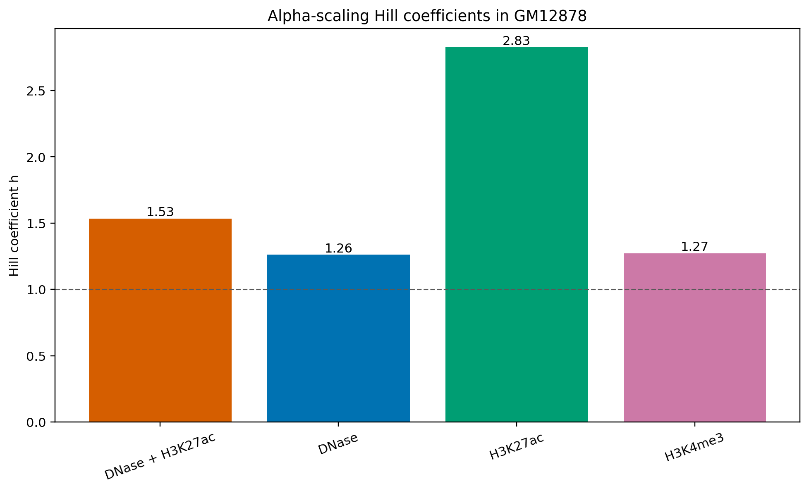

# MambaHiC: Hi-C Contact Map Prediction

This repository contains the retained code, model checkpoints, example data,
and analysis outputs for MambaHiC, a model that predicts Hi-C contact maps
from DNA sequence and epigenomic signals. The current release is organized
around six experiments covering window-level prediction, comparison with
C.Origami, cross-cell transfer, latent-space visualization, controlled
epigenomic perturbations, and model interpretation.

## Experiments

| ID | Experiment | Entry point | Resources included |
| --- | --- | --- | --- |
| 01 | GM12878 chromosome 7 prediction with CTCF and DNase tracks | [`01_hi-c_plots.ipynb`](01_real_window_prediction/01_hi-c_plots.ipynb) | Main checkpoint and 10 retained figures |
| 02 | MambaHiC versus reproduced C.Origami on 1,224 chromosome 7 windows | [`02_corigami_comparison.ipynb`](02_corigami_comparison/02_corigami_comparison.ipynb) | Both benchmark checkpoints and metric plots |
| 03 | Independently trained five-cell evaluation and shared-model transfer to held-out cell lines | [`03_cross_cell_transfer.py`](03_cross_cell_transfer/03_cross_cell_transfer.py), [`03_shared_transfer_matrix.py`](03_cross_cell_transfer/03_shared_transfer_matrix.py) | Retained figures only; cross-cell data and checkpoints are external |
| 04 | t-SNE visualization of fused bin embeddings, colored by predefined TAD intervals | [`04_tad_embedding.py`](04_tad_clustering/04_tad_embedding.py) | Example input, compatible checkpoint, and figures |
| 05 | Alpha-scaling response of DNase, H3K27ac, H3K4me3, and DNase + H3K27ac | [`05_phase_separation_reproduction/`](05_phase_separation_reproduction/) | Compatible checkpoint and final tables/figures |
| 06 | Global/local Integrated Gradients and in-silico CTCF deletion | [`06_interpretation.ipynb`](06_interpretability_and_editing/06_interpretation.ipynb) | Example input and compatible checkpoint |

Experiment 02 reports distance-stratified Pearson correlation (PCC), Spearman
correlation, and PSNR. Experiment 04 uses supplied boundary intervals to label
the embedding; it is not an unsupervised TAD-discovery method.

## Repository Layout

```text
.
|-- 01_real_window_prediction/
|-- 02_corigami_comparison/
|-- 03_cross_cell_transfer/
|-- 04_tad_clustering/
|-- 05_phase_separation_reproduction/
|-- 06_interpretability_and_editing/
|-- checkpoints/
|-- data/
|-- src/
|-- requirement.txt
```

`src/bulk_hic_prediction` contains the shared data loaders, model definitions,
checkpoint utilities, metrics, plotting functions, and evaluation helpers.

## Installation

Python 3.10 or later is recommended. From the repository root:

```bash
python -m venv .venv
source .venv/bin/activate
python -m pip install --upgrade pip
python -m pip install -r requirement.txt
```

A CUDA-enabled PyTorch environment is recommended. The official `mamba-ssm`
and `causal-conv1d` packages provide the accelerated CUDA implementation. A
checkpoint-compatible pure-PyTorch Mamba implementation is also included under
`src/mamba_ssm` for CPU inference, but it is substantially slower. Experiment
05 intentionally requires CUDA and does not write reproduction outputs on CPU.

Run all commands below from the repository root so that local imports and
relative checkpoint paths resolve correctly.

## Input Data

The bundled example [`chr7_6144000_7168000.pkl`](data/chr7_6144000_7168000.pkl)
represents one 1,024,000 bp region. Each preprocessed pickle is a dictionary
with the following core arrays:

| Key | Shape | Dtype | Description |
| --- | --- | --- | --- |
| `sequence_one_hot` | `(4, 1024000)` | `uint8` | One-hot DNA sequence |
| `omics_signals` | `(4, 512)` | `float32` | CTCF, DNase, H3K27ac, and H3K4me3 tracks |
| `hic_matrix` | `(512, 512)` | `float32` | Observed Hi-C contact map |

The example also stores `chromosome` and `interval`. Files are expected to use
names such as `chr7_6144000_7168000.pkl`.

Experiments requiring multiple cell lines expect the following external layout:

```text
/path/to/cross_cell_data/
|-- HFF_hg38/chr7_*.pkl
|-- H1HESC_hg38/chr7_*.pkl
|-- K562_hg38/chr7_*.pkl
|-- MCF7_hg38/chr7_*.pkl
`-- GM12878_hg38/chr7_*.pkl

/path/to/cross_cell_weights/
|-- HFF_hg38/best_model.pth
|-- H1HESC_hg38/best_model.pth
|-- K562_hg38/best_model.pth
|-- MCF7_hg38/best_model.pth
`-- GM12878_hg38/best_model.pth
```

## Running the Experiments

### 01. Real-window prediction

Open the notebook:

```bash
jupyter lab 01_real_window_prediction/01_hi-c_plots.ipynb
```

In its final configuration cell, replace the historical absolute paths. Set
`data_dir` to a directory of preprocessed pickle files (the bundled `data/`
directory can be used for a one-window run) and set `model_path` to:

```text
checkpoints/main/best_model.pth
```

The retained multi-window figures are in
[`01_real_window_prediction/final_visualizations/`](01_real_window_prediction/final_visualizations/).

### 02. C.Origami comparison

The notebook reads the GM12878 dataset location from an environment variable
and uses both bundled benchmark checkpoints automatically:

```bash
export GM12878_DATA_DIR=/path/to/gm12878/preprocessed/pkl
jupyter lab 02_corigami_comparison/02_corigami_comparison.ipynb
```

The retained comparison covers 1,224 original-stride chromosome 7 windows.

### 03. Cross-cell transfer

Evaluate each cell line using its independently trained checkpoint, optionally
including the full checkpoint-by-dataset PCC matrix:

```bash
python 03_cross_cell_transfer/03_cross_cell_transfer.py \
  --base-data-dir /path/to/cross_cell_data \
  --weights-dir /path/to/cross_cell_weights \
  --chromosome chr7 \
  --make-cross-matrix
```

Evaluate one model trained jointly on HFF, GM12878, and MCF7 against matched
chromosome 6 regions from held-out H1HESC and K562:

```bash
python 03_cross_cell_transfer/03_shared_transfer_matrix.py \
  --cell-a-dir /path/to/cross_cell_data/H1HESC_hg38 \
  --cell-b-dir /path/to/cross_cell_data/K562_hg38 \
  --checkpoint /path/to/shared_model/best_model.pth \
  --chromosome chr6
```

The required raw cross-cell data, independently trained checkpoints, and shared
checkpoint are not included in this repository.

### 04. TAD-colored fused embedding

This experiment is directly runnable with the bundled sample and its default
checkpoint:

```bash
python 04_tad_clustering/04_tad_embedding.py \
  --sample data/chr7_6144000_7168000.pkl
```

Use `--boundaries` to provide a comma-separated list that starts at `0` and
ends at `512`. The default is `0,75,110,160,190,360,395,512`.

### 05. Epigenomic alpha-scaling analysis

Experiment 05 scales selected input channels from alpha `0.0` to `2.0` in
increments of `0.1`, predicts 1,224 original-stride chromosome 7 windows, and
measures O/E-normalized gray-level co-occurrence matrix (GLCM) contrast. The
mean response is fitted with `baseline + C * alpha^h`.

The complete reproduction launcher expects six visible GPUs:

```bash
export DATA_DIR=/path/to/gm12878/preprocessed/pkl
bash 05_phase_separation_reproduction/run_all.sh
```

Set `MODES`, for example `MODES="dnase h3k27ac"`, to run a subset, or set
`PYTHON` to choose another Python executable. After shard aggregates already
exist, representative maps can be regenerated on four GPUs with:

```bash
export DATA_DIR=/path/to/gm12878/preprocessed/pkl
bash 05_phase_separation_reproduction/run_representatives.sh
```

See the experiment-specific [`README.md`](05_phase_separation_reproduction/README.md)
for output details.

### 06. Interpretation and in-silico editing

Open the notebook:

```bash
jupyter lab 06_interpretability_and_editing/06_interpretation.ipynb
```

The notebook includes global and local Integrated Gradients, sequence and
omics attribution for contact `(264, 49)`, and an in-silico CTCF deletion.

## Retained Experiment 05 Results

All four fitted responses are increasing over the tested alpha range:

| Scaled signal(s) | Hill coefficient `h` | R-squared |
| --- | ---: | ---: |
| DNase + H3K27ac | 1.535 | 0.996 |
| DNase | 1.262 | 0.996 |
| H3K27ac | 2.827 | 0.973 |
| H3K4me3 | 1.273 | 0.976 |



Per-mode response tables, fit summaries, representative predicted maps, and
insulation-score profiles are retained in
[`05_phase_separation_reproduction/results/`](05_phase_separation_reproduction/results/).

